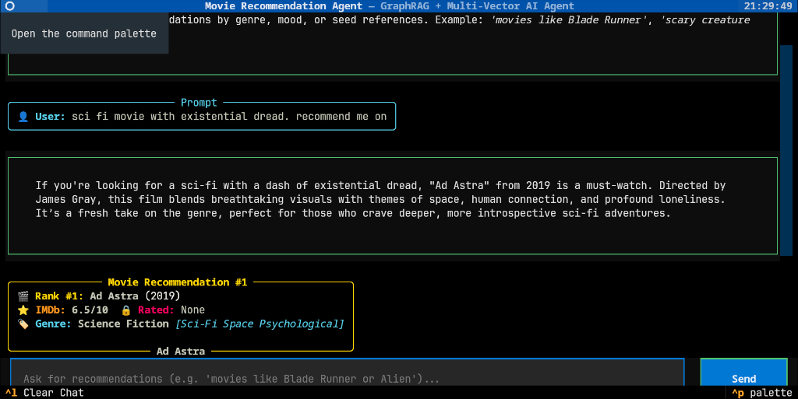

# Mogra Movie Recommender Agent 🎬🤖

**MograRecommenderAgent** is a high-performance local movie recommendation engine. It combines a **Knowledge Graph (Neo4j)** for strict factual relationships with **Multi-Vector Search (Qdrant)** across **16 storytelling channels** to understand narrative, aesthetic, and emotional similarity.

Configured by default to deliver **exactly 1 high-precision movie recommendation** per query—if no candidate matches the user's prompt, the system returns a clear, transparent message.

Powered by an interactive **Textual Terminal User Interface (TUI)**, a production **FastAPI REST Server with Swagger UI**, and running 100% locally via **Ollama (`qwen2.5:3b`)** and local text embeddings (`nomic-embed-text`).



---

## 🌟 Key Features

- **Single High-Precision Recommendation (`top_k=1`):** Delivers 1 optimal movie match per query across the engine, TUI, and REST API.
- **Deep Storytelling & Cinematic Nuance Graph:** Captures character development arcs, internal psychological flaws, philosophical themes, true-story factoids, ending tones, and narrative nuances.
- **16-Channel Storytelling Search:** Ranks movies across 16 distinct narrative and visual channels simultaneously (e.g., *Visual Aesthetic*, *Character Psychology*, *Soundscape*, *Tonal Arc*, *Dread & Suspense*, *Humor & Irony*).
- **Production REST API & Interactive Swagger UI:** Serves OpenAPI endpoints at `http://localhost:8000/docs` and ReDoc at `http://localhost:8000/redoc`.
- **100% Local Execution:** Runs entirely locally on Ollama (`qwen2.5:3b`) with zero cloud dependencies or external subscription fees.

---

## 🏗️ System Architecture & Workflow

```
┌────────────────────────────────────────────────────────────────────────┐
│                        MOGRA RECOMMENDER AGENT                         │
│                                                                        │
│  ┌──────────────────────────────┐     ┌─────────────────────────────┐  │
│  │   Textual Chat Terminal UI   │     │   FastAPI REST Web App      │  │
│  │   (tui_app.py)               │     │   (api/main.py)             │  │
│  └──────────────┬───────────────┘     └──────────────┬──────────────┘  │
│                 │                                    │                 │
│                 └──────────────────┬─────────────────┘                 │
│                                    ▼                                   │
│  ┌──────────────────────────────────────────────────────────────────┐  │
│  │                 Hybrid Graph + Multi-Vector Engine               │  │
│  │                 (engine/intent_parser.py, engine/retrieval.py)   │  │
│  └──────────────┬───────────────────────────────────┬───────────────┘  │
│                 │                                   │                  │
│                 ▼                                   ▼                  │
│  ┌──────────────────────────────┐    ┌──────────────────────────────┐  │
│  │   Neo4j Knowledge Graph      │    │ Qdrant Multi-Vector Database │  │
│  │   (Factual Relationships)    │    │ (16 Narrative Channels)      │  │
│  └──────────────────────────────┘    └──────────────────────────────┘  │
└────────────────────────────────────────────────────────────────────────┘
```

The system processes user requests in **5 streamlined steps**:

### 1. Intent Parsing
Natural language prompts are analyzed by Ollama (`qwen2.5:3b`) to extract:
- **Seed Anchors:** Reference movies mentioned by the user (e.g., *"movies like Interstellar"*).
- **Genre & Setting Filters:** Primary genres, subgenres, spatial settings, and rating limits.
- **Negative Exclusions:** Prohibited elements or specific movies to avoid.
- **Channel Prompts:** Targeted descriptions for visual, emotional, and psychological search.

### 2. Knowledge Graph Filtering
Executes Cypher graph queries against Neo4j to enforce factual relationships:
- **Genres & Subgenres:** Connects movies to top-level genres and specialized categories.
- **Spatial Settings:** Matches exact narrative environments (e.g., queries for *"space horror"* strictly match space settings, excluding ground-based horror films).
- **Franchise Lineages & Directors:** Tracks sequels and directorial styles.

### 3. 16-Channel Multi-Vector Search
Searches Qdrant across 16 specialized storytelling channels:
1. `visual_aesthetic` — Cinematography, lighting, color palette.
2. `character_psychology` — Internal motivation, mental trauma, psychological arc.
3. `soundscape` — Acoustic profile, music score, diegetic sound.
4. `emotional_aftertaste` — Lingering mood upon credits, catharsis, tragedy.
5. `philosophical_depth` — Existential themes, moral dilemmas, societal allegory.
6. `tonal_arc` — Pacing and emotional progression.
7. `dialogue_and_wit` — Script rhythm, banter, monologues, irony.
8. `pacing_and_kinetic_rhythm` — Editing momentum and urgency.
9. `spatial_atmosphere` — Environment, architecture, weather.
10. `cultural_historical_texture` — Period authenticity and historical realism.
11. `climactic_catharsis` — Climax payoff and narrative resolution.
12. `antagonist_threat_dynamics` — Opponent motivation and danger escalation.
13. `thematic_subtext_allegory` — Symbolic motifs and underlying themes.
14. `humor_and_irony_tone` — Satirical wit, dark comedy, dry humor.
15. `intimacy_and_chemistry` — Emotional connection and romantic tension.
16. `dread_suspense_escalation` — Looming paranoia and claustrophobia.

### 4. Ranked Score Fusion
Combines channel search rankings and knowledge graph constraints into a single ranked list.

### 5. Single Candidate Selection & Response Generation
Selects the top-ranked match (`top_k = 1`) to provide a clear recommendation. The local model synthesizes a natural explanation of why the movie matches the request. If no match meets the search criteria, a clear message is displayed:
> *"Sorry, I could not find the movie requested."*

---

## 🎭 Deep Cinematic Insights in Neo4j

Instead of simple tags, Mogra's **Neo4j Knowledge Graph** records rich storytelling nuances:

- **Character Arcs & Motivation:** Tracks character archetypes (*Lone Wanderer*, *Tragic Mentor*) and narrative progression (*Redemption Through Sacrifice*, *Descent into Madness*).
- **Themes & Moral Ambiguity:** Stores philosophical depth, moral ambiguity levels (*Grey*, *Nihilistic*), and speculative sci-fi realism.
- **Historical Accuracy & Factoids:** Records period era authenticity (*WWII*, *Regency*) and historical accuracy levels.
- **Storytelling Atmosphere:** Captures narrative elements like psychological dread, ending tone (*Bittersweet*, *Tragic*), and twist complexity.
- **Natural Story Matching:** Enables prompts like **"movies about existential dread and cosmic isolation"** to directly target movies with matching space settings and psychological dread profiles.

---

## 💬 Example Queries & Recommendations

### Example 1: Existential Dread & Space Isolation
> **User Prompt:** *"Recommend me a movie with suffocating existential dread, cosmic space isolation, and deep philosophical questions."*
>
> 🎯 **Recommendation:** ***Interstellar*** (2014)
> - **Graph Matching:** Setting = `Wormhole / Deep Space`, Genre = `Science Fiction`, Subgenre = `Cosmic Space Survival`.
> - **Channel Match:** Strong alignment on *Philosophical Depth* and *Spatial Atmosphere*.

---

### Example 2: Cyberpunk Tech-Noir Aesthetic
> **User Prompt:** *"I want a visual masterpiece set in a rainy neon dystopian city with heavy cybernetic tech-noir atmosphere."*
>
> 🎯 **Recommendation:** ***Blade Runner 2049*** (2017)
> - **Graph Matching:** Setting = `Los Angeles 2049`, Genre = `Science Fiction`, Subgenre = `Cyberpunk Tech-Noir`.
> - **Channel Match:** Strong alignment on *Visual Aesthetic* and *Soundscape*.

---

### Example 3: Soulful Family Animation
> **User Prompt:** *"Recommend a soulful, vibrant animated movie about passion and emotional growth that I can watch with kids."*
>
> 🎯 **Recommendation:** ***Soul*** (2020)
> - **Graph Matching:** Genre = `Animation`, Subgenre = `Jazz Metaphysical Comedy`, Target Demographic = `KIDS_FAMILY`.
> - **Channel Match:** Strong alignment on *Emotional Aftertaste* and *Character Psychology*.

---

### Example 4: Dark Satirical Comedy & Sharp Dialogue
> **User Prompt:** *"Give me a dark comedy crime movie with non-linear storytelling and witty dialogue banter."*
>
> 🎯 **Recommendation:** ***Pulp Fiction*** (1994)
> - **Graph Matching:** Genre = `Crime`, Subgenre = `Nonlinear Crime Comedy`, Humor Style = `DARK_SATIRE`.
> - **Channel Match:** Strong alignment on *Dialogue & Wit* and *Tonal Arc*.

---

## 🚀 Quick Start

### Automated Setup Script (Recommended)
Run the setup script to install dependencies, configure Docker database containers, and download required local models:
```bash
git clone https://github.com/Z33xD/odoo-transitops.git
cd MograRecommenderAgent
chmod +x install.sh
./install.sh
```

---

### Manual Setup

#### 1. Prerequisites
- **Python 3.10+** (Python 3.14 recommended)
- **Docker & Docker Compose**
- **Ollama** running locally (`ollama serve`) with models `qwen2.5:3b` and `nomic-embed-text` installed

#### 2. Environment Setup
```bash
python3 -m venv venv
source venv/bin/activate
pip install -r requirements.txt
```

#### 3. Start Database Containers
```bash
docker-compose up -d
```
- **Neo4j Browser:** [http://localhost:7474](http://localhost:7474) (`neo4j` / `password123`)
- **Qdrant Dashboard:** [http://localhost:6333/dashboard](http://localhost:6333/dashboard)

---

## 🖥️ User Interfaces

### Terminal User Interface (TUI)
Launch the interactive terminal chat application:
```bash
PYTHONPATH=. python3 tui_app.py
```

### Production REST API & Web Documentation
Launch the FastAPI server:
```bash
PYTHONPATH=. python3 run_api_server.py --port 8000
```
- **Interactive Swagger UI:** [http://localhost:8000/docs](http://localhost:8000/docs)
- **ReDoc Documentation:** [http://localhost:8000/redoc](http://localhost:8000/redoc)

---

## 📖 API Reference

For detailed endpoint payloads, header specifications, and example `curl` commands, refer to the API guide:
👉 **[API Documentation Manual (API.md)](file:///home/adi/Documents/Programming/MograRecommenderAgent/API.md)**

---

## 🧪 Running Automated Tests

Run the full automated test suite:
```bash
PYTHONPATH=. ./venv/bin/pytest tests/test_scalability_fixes.py tests/test_logger.py tests/test_api.py tests/test_graph_registry.py tests/test_retrieval_thresholds.py tests/test_tui.py
```

---

## 📂 Project Directory Structure

```text
.
├── API.md                      # REST API Endpoint Documentation
├── README.md                   # System Documentation & Guide
├── install.sh                  # One-click automated setup script
├── config.py                   # Central configuration
├── run_api_server.py           # FastAPI launcher script
├── tui_app.py                  # Terminal User Interface application
├── tui_styles.tcss             # Terminal UI stylesheet
├── api/                        # REST API endpoints & schemas
│   ├── main.py                 # FastAPI application setup
│   ├── routes.py               # Recommendation routes
│   └── schemas.py              # API request & response data models
├── data/                       # Seed movie datasets
├── db/                         # Neo4j, Qdrant, & cache registry
├── engine/                     # Core search, intent, & synthesis logic
├── logger/                     # Central diagnostic logging system
├── logs/                       # System diagnostic logs
├── schemas/                    # Domain data models
├── ui/                         # Terminal UI components
└── tests/                      # Automated test suite
```

---

## 📝 Diagnostic System Logging

System operational logs and component diagnostics are automatically maintained at `logs/system_master.log`.

---

## 🔮 Future Features & Roadmap

-  🌱 **Self-Noticing & Auto-Growing Movie Database:** Automated background ingestion agents that continuously monitor cinema releases, extract metadata, and self-expand the Neo4j knowledge graph and Qdrant vector store.
- 🌐 **Modern Web UI Dashboard:** Full-featured responsive web interface built with modern frontend frameworks for visual graph exploration, interactive filtering, and trailer previews.
- 👤 **Stateful Agentic Memory & User Preference Tracking:** Persistent user preference logging and multi-turn conversational memory allowing the agent to refine recommendations across sessions.
- 🔌 **Extensive REST API & Plugin Ecosystem:** Broadened API schemas, webhook integrations, and SDK connectors for embedding recommendation capabilities into external streaming services.
- 🧬 **Expanded Multi-Vector Narrative Channels:** Incorporating additional specialized vector spaces for soundtrack key signatures, directorial editing pace, color theory palettes, and subconscious psychological archetypes.
- 🌌 **Abstract & High-Concept Query Understanding:** Enhanced reasoning engines capable of resolving highly abstract, metaphorical, or poetic user prompts (*"movies that feel like a cold rainy Sunday afternoon in 1990s Paris"*).

